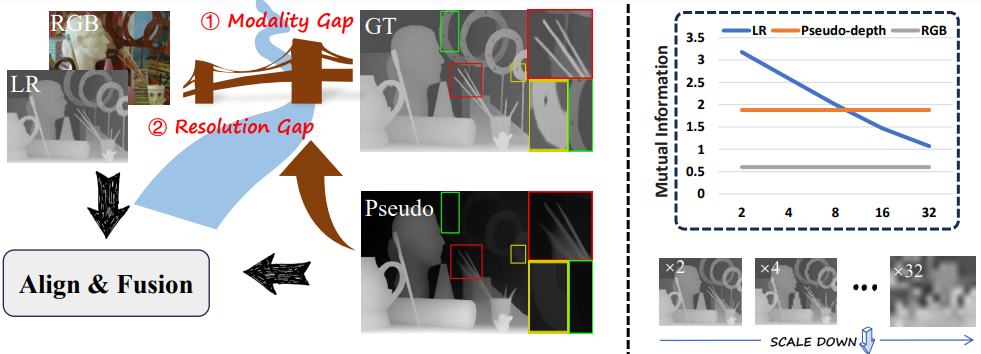

# Boosting Guided Depth Super-Resolution Through Large Depth Estimation Model and Alignment-then-Fusion Strategy

This repository contains the official implementation of the following paper:
> Boosting Guided Depth Super-Resolution Through Large Depth Estimation
Model and Alignment-then-Fusion Strategy<br/>
>  [Xinni Jiang]()<sup>*</sup>,[Yuanlin Zhang]()<sup>*</sup>,  [Chunle Guo](https://mmcheng.net/clguo/), [Chongyi Li](https://li-chongyi.github.io/)<br/>


[[Paper]()]





## Setup

### Dependencies
The conda environment with all required dependencies can be generated by running
```bash
conda env create -f environment.yml
conda activate d2a2
cd models/Deformable_Convolution_V2
sh make.sh
```
Note:the versions of GCC and CUDA need to be compatible.


### Datasets
The [NYUv2](https://cs.nyu.edu/~silberman/datasets/nyu_depth_v2.html) dataset can be downloaded [here](https://drive.google.com/file/d/1ZWpiVkog5aDBzVi2dCjGGSdiVqrLNTjR/view?usp=sharing). 
Your folder structure should look like this:
```
NYUv2
└───Depth
│   │   0.npy
│   │   1.npy
│   │   2.npy
│   │   ...
│   │   1448.npy 
└───RGB
│   │   0.jpg
│   │   1.jpg
│   │   2.jpg
│   │   ...
│   │   1448.jpg
└───MDE_relative
│   │   0.png
│   │   1.png
│   │   2.png
│   │   ...
│   │   1448.png
```

Lu, Middlebury and RGBDD datasets are only used for testing and can be downloaded [here](https://drive.google.com/file/d/1EKkk0ZRjbbf_ajh5KUrjw0TTq8G19bZ8/view?usp=sharing).
The MDE_relative is obtained from [Depth-Anything-V2-Large](https://github.com/DepthAnything/Depth-Anything-V2?tab=readme-ov-file).


### Pretrained Model
Download pretrained models from [Pretrained Models](https://drive.google.com/drive/folders/1HJmnZeDiznyc3HiO03qcpaS1D4IuPRRA?usp=drive_link), and put them in the pretrained folder.


## Testing

Please modify the ``'--scale'``,``'--dataset_dir'``,``'--net_path'``in file ``'option.py'``. 
```bash
python test_d2a2.py
```

## Training

Please modify the ``'--scale'``,``'--dataset_dir'``in file ``'option.py'``. 
```bash
python train_d2a2_depthanything_L.py
```

## Acknowledgements

We thank these repos sharing their codes: [DepthAnything](https://github.com/DepthAnything/Depth-Anything-V2?tab=readme-ov-file).

## Citation

```
```
